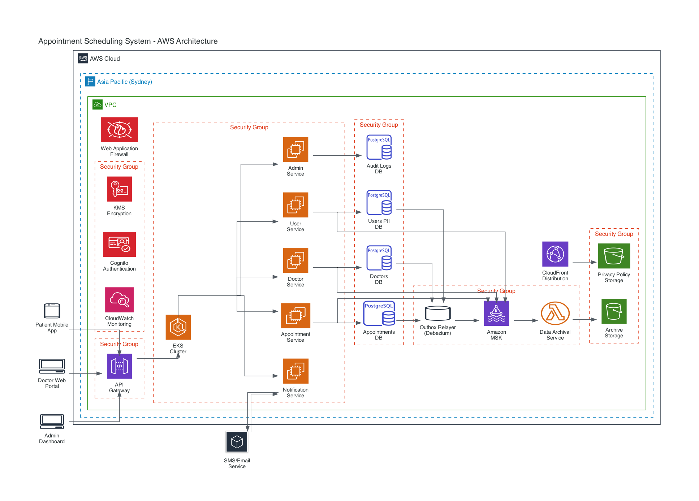

# Appointment Scheduling System Design

The system is designed using a microservices architecture, driven by event-based communication. Key principles include privacy-by-design, robust pseudonymity, and efficient handling of distributed system challenges, including real-time updates for dynamic scheduling data via Server-Sent Events (SSE).

## Assumptions

This system design is based on the following assumptions:

- The system operates entirely on **AWS, within a single region**
- The target user base for the initial scope is **adult patients only**.
- While I've worked in healthcare services before, I appreciate Hipaa style-compliance is not the same in Australia, and it's been a few years since I've been in that type of environment. In my research I found, Australia uses the **"Healthcare Identifiers (HI) Service"** as the universal patientId store, and **"My Health Record (MHR)"** as the universal patients notes service
  - Initial scope **does not include direct integration with "My Health Record" or the "Healthcare Identifiers (HI) Service"**, positioning this as a standalone system while keeping these services in mind for the future.
- The service is either **free for patients or integrates with a third-party payment gateway** (e.g., Stripe) which is out of this system's direct scope.
- There is **no advanced prioritization logic for doctors** (e.g., based on patient volume, issue type), beyond the automatic re-assignment mechanism detailed.
- The system **does not include fallback mechanisms for scenarios where no doctors are available** for extended periods, beyond attempting re-assignment.
- Beyond a basic "reason for visit," the system **will not store clinical notes, scanned documents, or images** (e.g., X-rays).
- **GitHub and GitHub Actions runners** are assumed for the CI/CD pipeline.
- **Prisma** is the chosen ORM, handling database migrations.
- Microservices are developed using **Node.js with the NestJS framework**.
- **Any doctor can be assigned to any patient.**
- In case a doctor is no longer available, instead of canceling the appointment for a patient, they should be **automatically re-assigned to a new available doctor**. Patients will be notified of this change via SMS or email.
- The client-side application (web or native) is responsible for consuming SSE streams using an **EventSource client**. It is also primarily responsible for handling SSE connection drops, re-establishing connections, informing the user that the schedule may no longer be up-to-date, and visually indicating a data re-sync process.
- Dead Letter Queue was not addressed (both the service, nor the process around it).
- Developers don't have access to production data, should generate mock data for development/testing
- There should be playbooks for different processes, e.g: deployment, incident management, postmortems, etc.. Those are not included in this design.
- Assuming only automated testing though, really there should be shoulder checks, or PO sign offs before going to UAT/prod.
- Massive assumption these are all the features needed though the system is flexible enough for add-ons
- Because of the microservice architecture, there could be a need for a BFF service

## Core Principles & Architecture

The secure, reliable, and scalable core principles that the system is built on are:

- **Privacy-by-Design & Security-by-Design:** Privacy and security are not afterthoughts but are embedded into every layer of the system architecture from conception. This includes data segregation, stringent access controls, and encryption at rest and in transit.
- **Strong Pseudonymity & Data Segregation:** Patient Personally Identifiable Information (PII) is strictly separated from other data. A `users_pii_vault` database stores sensitive PII, while other services only interact with a `clientID`, a pseudonymous identifier.
- **Microservices Architecture with Event-Driven Communication:** The system is composed of independent, loosely coupled microservices, each responsible for a specific business capability. Communication between services is primarily asynchronous and event-driven, facilitated by Apache Kafka (managed via Amazon MSK).
- **Role-Based Access Control (RBAC) & Least Privilege:** Access to system resources and data is granted based on the user's defined role (e.g., Patient, Doctor, Clinic Admin, Practice Manager, System Administrator) and the principle of least privilege.
- **Scalability & High Availability:** The architecture leverages various AWS services to ensure the system can handle increasing loads and maintain continuous operation. This includes container orchestration with AWS EKS, managed databases, and auto-scaling capabilities.
- **Comprehensive Auditability:** All significant actions and data modifications within the system are meticulously logged to an immutable `Audit Logs DB`. `CorrelationId` is used for tracing requests across services.
- **Real-time Communication for Dynamic Scheduling Data:** To enhance user experience and minimize race conditions during booking, the system is designed to provide immediate, near real-time updates to client applications regarding appointment slot availability, doctor status changes, and proactive re-assignments. This is primarily achieved through Server-Sent Events (SSE).

## High-Level AWS Architecture Overview

## Architecture Documentation

### [Infrastructure & Implementation](infrastructure.md)

### [Operations & Compliance](operations.md)
